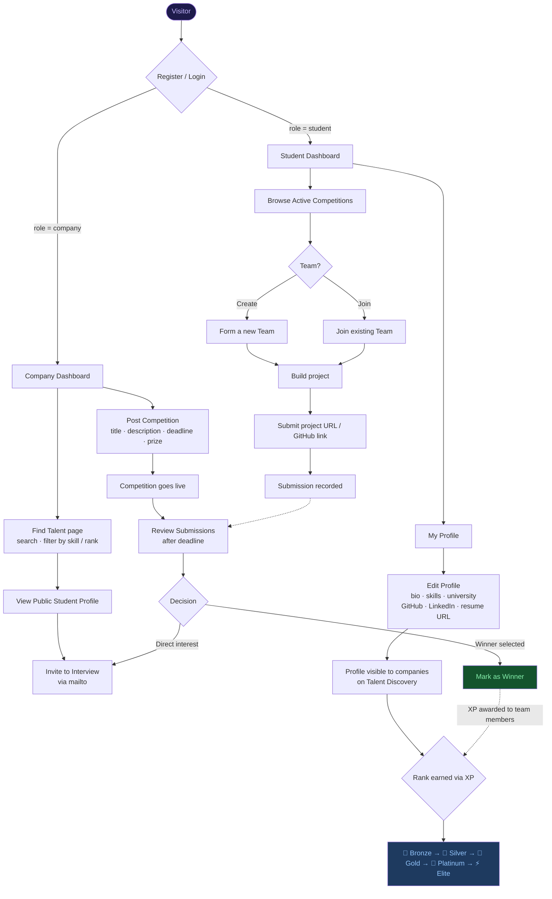

# Agon — Competitive Hiring Platform

> **A two-sided marketplace where companies source talent through hackathons, and students prove their skills by building real products.**

[](https://djangoproject.com)
[](https://nextjs.org)
[](https://mysql.com)
[](https://docker.com)
[](https://typescriptlang.org)

---

## What is Agon?

**Agon** (from the Greek word for *contest*) reimagines technical recruiting. Instead of résumés and whiteboard interviews, companies post real engineering challenges. Students form teams, build solutions, and submit their work. Companies hire based on what candidates actually build — not how they perform under artificial pressure.

The platform has three interconnected layers:

| Layer | What it does |
|-------|-------------|
| **Competition Hub** | Companies post hackathon challenges; students browse and compete |
| **Team Arena** | Students form cross-disciplinary teams and submit project deliverables |
| **Talent Discovery** | Students build verified, ranked profiles; companies filter and recruit directly |

---

## Platform Architecture

```
┌─────────────────────────────────────────────────────────────┐
│                        BROWSER                              │
│                                                             │
│   Next.js 16 (App Router · TypeScript · Tailwind CSS)      │
│                                                             │
│  /          /auth      /student     /student/profile        │
│  Landing    Login      Dashboard    My Profile              │
│                                                             │
│  /student/competitions/[id]         /students/[id]          │
│  Detail + Form Team + Submit        Public Profile          │
│                                                             │
│  /company   /company/talent         /company/competitions/  │
│  Dashboard  Find Talent             new  ·  [id]/submissions│
└────────────────────────┬────────────────────────────────────┘
                         │  Axios + JWT Bearer
                         │  http://localhost:8000
┌────────────────────────▼────────────────────────────────────┐
│                     DJANGO REST API                         │
│                                                             │
│  /api/v1/auth/      /api/v1/users/    /api/v1/competitions/ │
│  /api/v1/teams/     /api/v1/submissions/                    │
│  /api/v1/profiles/  (StudentProfile + filters)              │
│                                                             │
│  JWT Auth (SimpleJWT) · Custom Permissions · DRF Router    │
└────────────────────────┬────────────────────────────────────┘
                         │  mysqlclient ORM
┌────────────────────────▼────────────────────────────────────┐
│                    MySQL 8.0 (Docker)                       │
│                                                             │
│  users · competitions · teams · team_members                │
│  submissions · student_profiles                             │
└─────────────────────────────────────────────────────────────┘
```

---

## Full User Flow



---

## Data Model

```mermaid
erDiagram
    USER {
        int id PK
        string email UK
        string first_name
        string last_name
        enum role "student | company"
        string company_name "company only"
        datetime date_joined
    }

    COMPETITION {
        int id PK
        string title
        text description
        int host_company_id FK
        datetime deadline
        text prize_description
        bool is_active
        datetime created_at
    }

    TEAM {
        int id PK
        string name
        int competition_id FK
        datetime created_at
    }

    TEAM_MEMBER {
        int id PK
        int team_id FK
        int user_id FK
        bool is_captain
        datetime joined_at
    }

    SUBMISSION {
        int id PK
        int team_id FK
        int competition_id FK
        string file_url
        text description
        datetime submitted_at
    }

    STUDENT_PROFILE {
        int id PK
        int user_id FK_UK
        text bio
        string university
        int graduation_year
        text skills "comma-separated tags"
        string github_url
        string linkedin_url
        string portfolio_url
        string resume_url "Google Drive link"
        string transcript_url "Google Drive link"
        int xp
        enum rank "bronze|silver|gold|platinum|elite"
        datetime updated_at
    }

    USER ||--o{ COMPETITION : "hosts"
    USER ||--o{ TEAM_MEMBER : "joins"
    USER ||--o| STUDENT_PROFILE : "has profile"
    TEAM ||--o{ TEAM_MEMBER : "has members"
    COMPETITION ||--o{ TEAM : "attracts"
    TEAM ||--o{ SUBMISSION : "makes"
    COMPETITION ||--o{ SUBMISSION : "receives"
```

---

## Rank & XP System

Students earn XP by placing in competitions. XP unlocks rank tiers which are prominently displayed on their public profile and on the talent discovery page.

```
  0 XP ──── 200 XP ──── 500 XP ──── 1000 XP ──── 2000 XP
    │           │           │            │             │
  🥉 Bronze  🥈 Silver  🥇 Gold    💎 Platinum   ⚡ Elite
```

Rank is auto-calculated every time XP is updated — no manual intervention required.

---

## Auth Flow

```
Register → POST /api/v1/auth/register/
         → Returns { access, refresh, user }
         → Tokens stored in localStorage
         → Redirect: student → /student | company → /company

Login    → POST /api/v1/auth/login/
         → Returns { access, refresh, user }

Refresh  → POST /api/v1/auth/token/refresh/
         → Called automatically on 401 by Axios interceptor
         → On failure: clears tokens and redirects to /auth

Logout   → Clears localStorage → Redirects to /
```

All protected pages check `useAuth().user` on mount and redirect to `/auth` if null.

---

## API Reference

All endpoints are prefixed `/api/v1/`. JWT Bearer token required on protected routes.

### Auth (public)

| Method | Endpoint | Description |
|--------|----------|-------------|
| `POST` | `/auth/register/` | Create account (student or company) |
| `POST` | `/auth/login/` | Obtain access + refresh tokens |
| `POST` | `/auth/token/refresh/` | Refresh access token |

### Users

| Method | Endpoint | Auth | Description |
|--------|----------|------|-------------|
| `GET` | `/users/me/` | Required | Get current user |
| `GET` | `/users/{id}/` | Required | Get user by ID |
| `PATCH` | `/users/{id}/` | Owner | Update profile |

### Competitions

| Method | Endpoint | Auth | Description |
|--------|----------|------|-------------|
| `GET` | `/competitions/` | Public | List all competitions |
| `POST` | `/competitions/` | Company | Create competition |
| `GET` | `/competitions/{id}/` | Public | Competition detail |
| `PATCH` | `/competitions/{id}/` | Owner | Update competition |
| `DELETE` | `/competitions/{id}/` | Owner | Delete competition |

### Teams

| Method | Endpoint | Auth | Description |
|--------|----------|------|-------------|
| `GET` | `/teams/?competition_id=` | Required | List teams for a competition |
| `POST` | `/teams/` | Required | Create team (creator becomes captain) |
| `POST` | `/teams/{id}/join/` | Student | Join a team |
| `POST` | `/teams/{id}/leave/` | Required | Leave a team |
| `GET` | `/teams/{id}/members/` | Required | List team members |

### Submissions

| Method | Endpoint | Auth | Description |
|--------|----------|------|-------------|
| `GET` | `/submissions/?competition_id=` | Required | List submissions |
| `POST` | `/submissions/` | Team member | Create submission |
| `PATCH` | `/submissions/{id}/` | Team member | Update submission |

### Student Profiles

| Method | Endpoint | Auth | Description |
|--------|----------|------|-------------|
| `GET` | `/profiles/` | Public | List all profiles |
| `GET` | `/profiles/?skill=python&rank=gold&search=name` | Public | Filtered profiles |
| `POST` | `/profiles/` | Student | Create own profile |
| `GET` | `/profiles/me/` | Required | Get own profile |
| `GET` | `/profiles/{id}/` | Public | Get profile by ID |
| `PATCH` | `/profiles/{id}/` | Owner | Update profile |

---

## Tech Stack

### Backend

| Layer | Technology |
|-------|-----------|
| Language | Python 3.11 |
| Web Framework | Django 4.2 |
| API Framework | Django REST Framework 3.14 |
| Authentication | djangorestframework-simplejwt |
| Database | MySQL 8.0 |
| Containerization | Docker + Docker Compose |
| Config | python-decouple |

### Frontend

| Layer | Technology |
|-------|-----------|
| Framework | Next.js 16 (App Router) |
| Language | TypeScript 5 |
| Styling | Tailwind CSS |
| HTTP Client | Axios (with JWT interceptors) |
| Icons | Lucide React |
| Auth | JWT stored in localStorage via React Context |

---

## Project Structure

```
Agon/
├── docker-compose.yml           # Orchestrates web + db services
├── Dockerfile                   # Python 3.11 container
├── entrypoint.sh                # Startup: wait for MySQL → migrate → runserver
├── requirements.txt
├── .env.example                 # Copy to .env and fill in secrets
├── .gitignore
├── README.md
│
├── agon/                        # Django project config
│   ├── settings.py              # DB, JWT, CORS, installed apps
│   ├── urls.py                  # Mounts /api/v1/ → api.urls
│   └── wsgi.py
│
├── api/                         # Core Django app
│   ├── models.py                # User, Competition, Team, TeamMember, Submission, StudentProfile
│   ├── serializers.py           # DRF serializers (list + detail variants)
│   ├── views.py                 # ViewSets + custom permissions + actions
│   ├── urls.py                  # DRF Router
│   ├── admin.py                 # Django admin
│   └── migrations/
│
└── frontend/                    # Next.js application
    ├── src/
    │   ├── app/
    │   │   ├── page.tsx                          # Landing page
    │   │   ├── auth/page.tsx                     # Login + Register
    │   │   ├── student/
    │   │   │   ├── page.tsx                      # Student dashboard
    │   │   │   ├── profile/page.tsx              # Own profile view
    │   │   │   ├── profile/edit/page.tsx         # Edit profile form
    │   │   │   └── competitions/[id]/page.tsx    # Competition detail
    │   │   ├── students/
    │   │   │   └── [id]/page.tsx                 # Public student profile
    │   │   └── company/
    │   │       ├── page.tsx                      # Company dashboard
    │   │       ├── talent/page.tsx               # Talent discovery feed
    │   │       └── competitions/
    │   │           ├── new/page.tsx              # Create competition
    │   │           └── [id]/submissions/page.tsx # Review submissions
    │   ├── components/
    │   │   ├── Navbar.tsx                        # Role-aware navbar
    │   │   ├── Footer.tsx
    │   │   └── ui/
    │   │       ├── Button.tsx                    # Variant button component
    │   │       └── Modal.tsx                     # Reusable modal
    │   ├── lib/
    │   │   ├── api.ts                            # Axios + JWT interceptors
    │   │   ├── auth.tsx                          # AuthContext + useAuth hook
    │   │   └── mockData.ts                       # Fallback data (demo mode)
    │   └── types/
    │       └── index.ts                          # TypeScript interfaces
    └── package.json
```

---

## Getting Started

### Prerequisites

- [Docker Desktop](https://www.docker.com/products/docker-desktop/) installed and running
- Node.js 18+ (for the frontend)
- No local Python or MySQL required — Docker handles everything

### 1. Clone the repo

```bash
git clone https://github.com/YOUR_USERNAME/agon.git
cd agon
```

### 2. Backend setup

```bash
cp .env.example .env
# Edit .env with your preferred values (any password works for local dev)

docker compose up --build
```

This automatically:
- Builds the Django image
- Starts MySQL 8.0
- Waits for MySQL to be ready
- Runs `makemigrations` + `migrate`
- Starts Django dev server on **http://localhost:8000**

### 3. Frontend setup

```bash
cd frontend
npm install
cp .env.local.example .env.local   # sets NEXT_PUBLIC_API_URL
npm run dev
```

Frontend runs on **http://localhost:3000**

### 4. Verify

```bash
curl http://localhost:8000/api/v1/competitions/   # → []
```

Open http://localhost:3000 — you should see the Agon landing page.

> **Offline mode:** If the backend isn't running, the frontend falls back to built-in mock data and displays a "Demo mode" badge. The full UI is explorable without the backend.

---

## Environment Variables

### Backend (`.env`)

| Variable | Description | Example |
|----------|-------------|---------|
| `SECRET_KEY` | Django secret key | any random string |
| `DEBUG` | Debug mode | `True` |
| `ALLOWED_HOSTS` | Comma-separated hosts | `localhost,127.0.0.1` |
| `DB_NAME` | MySQL database name | `agon_db` |
| `DB_USER` | MySQL username | `agon_user` |
| `DB_PASSWORD` | MySQL password | any password |
| `DB_HOST` | MySQL host (Docker service) | `db` |
| `DB_PORT` | MySQL port | `3306` |
| `MYSQL_ROOT_PASSWORD` | MySQL root password | any password |

### Frontend (`.env.local`)

| Variable | Description | Default |
|----------|-------------|---------|
| `NEXT_PUBLIC_API_URL` | Backend API base URL | `http://localhost:8000/api/v1` |

---

## Useful Docker Commands

```bash
# Start everything
docker compose up

# Start in background
docker compose up -d

# View backend logs
docker compose logs -f web

# Stop
docker compose down

# Full reset (clears database)
docker compose down -v && docker compose up --build

# Django shell
docker compose exec web python manage.py shell

# Create admin user
docker compose exec web python manage.py createsuperuser
```

---

## Page Map

| Route | Role | Description |
|-------|------|-------------|
| `/` | Public | Landing page — hero, value prop, competition feed |
| `/auth` | Public | Login + Register with role selection |
| `/student` | Student | Competition feed with search |
| `/student/profile` | Student | Own profile: rank badge, XP bar, skills, links |
| `/student/profile/edit` | Student | Edit form for all profile fields |
| `/student/competitions/:id` | Student | Competition detail + Form Team + Submit |
| `/students/:id` | Public | Read-only public student profile |
| `/company` | Company | Dashboard with competition list and stats |
| `/company/talent` | Company | Talent discovery: filter by skill, rank, search |
| `/company/competitions/new` | Company | Create a competition |
| `/company/competitions/:id/submissions` | Company | Review and evaluate team submissions |

---

## Design System

| Token | Value | Usage |
|-------|-------|-------|
| Background | `gray-950` `#030712` | Page background |
| Surface | `gray-900` | Cards, panels |
| Border | `gray-800` | Card borders |
| Primary | `violet-600` | Buttons, links, highlights |
| Accent | `cyan-400` | Secondary actions, success |
| Font | Inter (via `next/font`) | All text |

---

## Rank Colour Reference

| Rank | XP Required | Colour | Icon |
|------|-------------|--------|------|
| Bronze | 0 | `orange-400` | 🥉 |
| Silver | 200 | `gray-300` | 🥈 |
| Gold | 500 | `yellow-400` | 🥇 |
| Platinum | 1 000 | `cyan-400` | 💎 |
| Elite | 2 000 | `violet-400` | ⚡ |

---

## Roadmap

- [x] Backend MVP — Auth, Competitions, Teams, Submissions
- [x] Frontend MVP — All pages with mock-data fallback
- [x] Student Profile system with XP & rank tiers
- [x] Company Talent Discovery with skill/rank/search filters
- [ ] Live XP awards when competition winners are selected
- [ ] Public Leaderboard page
- [ ] Competition categories / tags
- [ ] Production deployment (Railway + Vercel)
